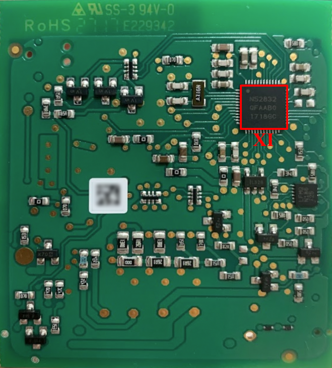
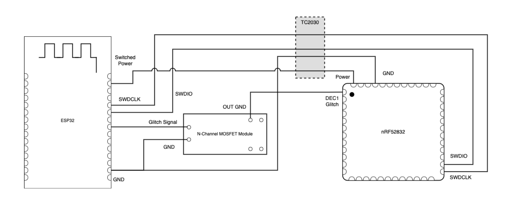
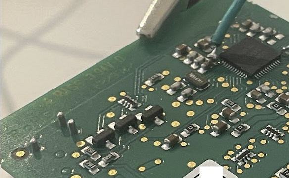
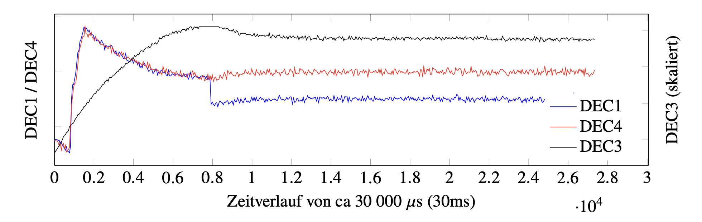
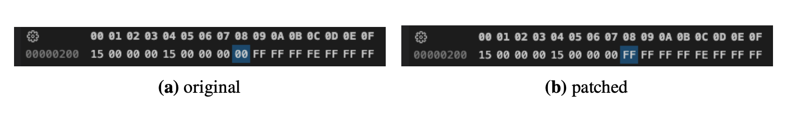
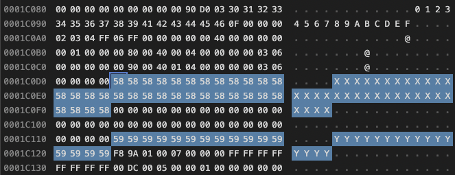
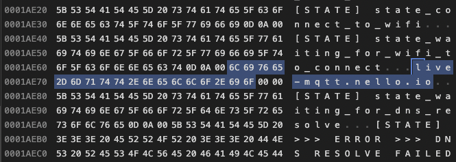
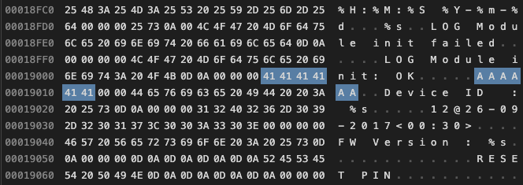
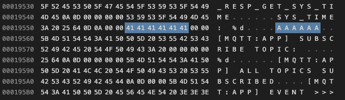
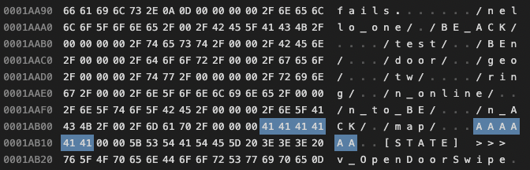

# Nello One Docs

## Table of Contents

- [Nello One Docs](#nello-one-docs)
  - [Table of Contents](#table-of-contents)
  - [Hardware Overview](#hardware-overview)
  - [Firmware \& Debug Access](#firmware--debug-access)
  - [Known Firmare Versions](#known-firmare-versions)
  - [Initial Configuration and Pairing](#initial-configuration-and-pairing)
  - [MQTT Connection](#mqtt-connection)
  - [Message encryption](#message-encryption)
  - [Messages](#messages)
    - [General](#general)
    - [`/nello_one/<client-id>/map/`](#nello_oneclient-idmap)
    - [`/nello_one/<client-id>/test/`](#nello_oneclient-idtest)
    - [`/nello_one/<client-id>/BEn/`](#nello_oneclient-idben)
    - [`/nello_one/<client-id>/n_ACK/`](#nello_oneclient-idn_ack)
    - [`/nello_one/<client-id>/n_online/`](#nello_oneclient-idn_online)
    - [`/nello_one/<client-id>/BE_ACK/`](#nello_oneclient-idbe_ack)
    - [`/nello_one/<client-id>/geo/`](#nello_oneclient-idgeo)
    - [`/nello_one/<client-id>/tw/`](#nello_oneclient-idtw)
    - [`/nello_one/<client-id>/ring/`](#nello_oneclient-idring)
  - [Intercom Configuration Values](#intercom-configuration-values)
  - [Simplified State Diagram](#simplified-state-diagram)
  - [Firmware Patching](#firmware-patching)
    - [General](#general-1)
    - [Hardware Glitching (Fault Injection Attack)](#hardware-glitching-fault-injection-attack)
    - [Deactivate APPROTECT](#deactivate-approtect)
    - [AES Encryption Key Material](#aes-encryption-key-material)
    - [MQTT Broker Hostname](#mqtt-broker-hostname)
    - [Nello Device ID](#nello-device-id)

## Hardware Overview

The chip of the Nello One consists of the following hardware components, which are mainly SMDs soldered to the custom IC.

| # | Component | Info |
| - | ------------- | ---- |
| I | SMD Pushbutton | Reset Button to return to factory settings |
| II | LED | LED at the buttom right to indicate the current status |
| III | Light Sensor | Next to the LED to receive the initial configuration data via the app |
| IV | `DMF3Z5R5H474M3DTA0` | Supercapacitor to balance unreliable power supply |
| V | `ATWINC1510` | Wifi Module (2.4G) |
| VI | `ULN2001` | Darlington Array |
| VII | `V014642` | Issue Door Open Signals |
| VIII | `WEP711 YR` | Transient Voltage Suppressor |
| IX | `MB1S` | Bridge Rectifier |
| X | `TC2030-NL` | Serial Connection Pins (SWD) |
| XI | `nRF52832-QFAA` | Processor + Flash (SoC) |

  


## Firmware & Debug Access

A connection to the nRF52 is available over the serial interface located at the top right of the chip.
With a TC2030-NL cable, a stable connection to the pins can be established.
The debug port is protected (`APPROTECT` flag activated in `UICR`) by the manufacturer, thus normally not allowing debug access (logs, breakpoints, reading flash or registers).
What is possible with the protection though is to re-flash the chip with a new firmare, leading to a deletion of the existing contents in the flash.

On the other hand, a hardware vulnerability is known in the nRF52 family, making it possible to boot the chip temporarily with the protection disabled using the *Fault Injection* technique (also known as *Hardware Glitching*).
The vulnerability was published by [LimitedResults](https://limitedresults.com/2020/06/nrf52-debug-resurrection-approtect-bypass/).
As this allows full access to the flash until the next reset / reboot, the full contents can be extracted.
With the downloaded firmware, the nello one can now be reflashed with an arbitrary patched version, including the activated debug port.

## Known Firmare Versions

| Version String | Info |
| -------------- | ---- |
| 12@26-09-2017<00:30> | The firmware most of the analysis was performed on |
| 13@15-02-2017<13:30> | |

## Initial Configuration and Pairing

When being paired using the Nello App, the app transmits the configuration data using light signals (flashing of the screen).
The nello can only receive data when being in a special mode, waiting for the configuration data.
This mode is active after the nello has been reset using the button at the side of the device and when powering a reset or unconfigured device.

The transmission of data is being started using a preamble sequence, that must be received completely.
Any issue receiving the preamble (for example too late) or any other error in detecting one of the transmitted signals leads to a failure of the configuration operation and requires a new attempt from the beginning on.

To start the preamble, the screen is set to the bright state for 3 seconds in order to have light sensor for sure at a suitable value.
After the initial value, the screen alternates the dark and bright state with a delay of 300ms for 10 times each (including the initial long bright state).

After the preamble, the actual data transmission starts, which includes 4 data fields.
Each data field consists of the actual data, followed by a CRC16 checksum and the end of a section indicated by a 400ms delay.
The transmitted data is encoded using its binary represenation with the dark states of 100ms each being the clock of the transmission.
The duration of a bright state indicates its bit value, 100ms for sending a `0` and 200ms for sending a `1`.

The following 4 data fields are transmitted:

- SSID of the wifi entered in the app
- Password of the wifi entered in the app
- Short Location ID received via API from the Backend
- Power Level (Int Value used internally, depends on the selected intercom model)

## MQTT Connection

After successful configuration as well as each subsequent boot of the chip, the Nello attempts to connect to the configured wifi network.
If a connection to the internet is giving, which is being tested using a DNS query for  `live-mqtt.nello.io`.
The resulting IP is being used to connect to a MQTT broker on port 1883 (MQTT without TLS).
Each nello has a unique `Client ID` assigned by the manufacturer persistently stored in the Firmware (Flash).
This client id is also used as MQTT client id during the connection establishment.

On successful connection to the MQTT broker, the Nello subscribes to the following 6 topics with QoS "At least once delivery – Acknowledged deliver", which are only used for receiving data from the server:

| Topic | Purpose |
| -------------- | ---- |
| `/nello_one/<client-id>/test/`| Receive detailed configuration for the intercom model |
| `/nello_one/<client-id>/BE_ACK/`| Acknowledgments by the backend incl. current target state |
| `/nello_one/<client-id>/tw/`| Command to enable or disable the timewindow mode |
| `/nello_one/<client-id>/geo/`| Command to enable or disable the geo mode |
| `/nello_one/<client-id>/door/`| Command to open the door |
| `/nello_one/<client-id>/BEn/`| State Transitions during learning |

The nello eventually sends message onto the following topics, which are only used for sending:

| Topic | Purpose |
| -------------- | ---- |
| `/nello_one/<client-id>/map/`| Request configuration from Backend, for example on startup |
| `/nello_one/<client-id>/n_ACK/`| Acknowledgement by the nello for commands from the server |
| `/nello_one/<client-id>/n_to_BE/`| Messages during the learning phase |
| `/nello_one/<client-id>/n_online/`| Test the online status regularly |
| `/nello_one/<client-id>/ring/`| Notification about a bell ring |

As the MQTT protocol without any transport layer encryption is being used, the MQTT metadata can be observed an arbitrary thrid party.
This can, with the knowledge about the Nello client id, be used to identify `ring` or `door` messages, which clearly indicates their purpose.
The topics are not protected by any credentials, thus allowing anybody to join and listen.

The payloads of each message are symmetrically encrypted, preventing a joining thrid party to read the clear text messages or send commands to the server or the nello.
More information regarding the message encryption can be found the next section.

## Message encryption

All exchanged message payloads over MQTT are enrypted using a symmetric encryption with AES-256 in CBC mode.
The key material is unique per nello device and never exchanged, but stored on the flash during manufacturing.

With an extracted firmware the key material can easily be located.
One approach is to run `strings` on the firmware binary, where the key of 32 characters / bytes is apparent.
Another approach is to locate the key in the relevant section of the binary.
In the analyzed version, the AES key was located at adress `0x0001C0D4`.
The IV is also stored statically (unique per device) in the flash and is directly located next to the key with a length of 16 bytes / characters.
A static IV is generally uncommon and not recommended.
Common practice is to send a changing IV per message as part of the encrypted message, which is *not* done by the Nello or the backend.

> **Note:** For encryption, the cleartext is padded (if necessary) and encoded using Base64. This needs to be considered when decoding.

## Messages

### General

The regular structure of messages exchanged between the Nello One and the Server is the following:

```
encryptAndEncode("<message>@<timestamp>@") + "\n"
```

The encryption happens as described above using AES-256 CBC with the encryption key and IV stored on the flash. At the end of each message a end-of-line character is added.

The timestamp included in the cleartext is used to prevent replay attacks, as the client and server is only accepting messages with a certain difference regarding the included timestamp and the current system time.
As the hardware of the Nello One does not contain a clock keeping track of the time even when the system is powered off, there is no time known on startup of the `nRF52`. With the first message received by the backend, the nello syncs its internal clock (time established since system start) with the received timestamp. This is the reason why the first message sent by the nello, does not contain an actual timestamp.

### `/nello_one/<client-id>/map/`

| | |
| --- | --- |
| Sender | **Nello** |
| Content | `<short-location-id>@0@` |

Request to receive the current configuration from the backend 

### `/nello_one/<client-id>/test/`

| | |
| --- | --- |
| Sender | **Server** |
| Content | `<a>;<b>;<c>;<d>;<e>;<f>;<g>;<h>;@<timestamp>@` |

Detailed configuration for the configured intercom model including the timestamp used for syncing the internal clock of the device.


| Field | Explanation |
| --- | --- |
| `<a>` | `comp_trigger_voltage` |
| `<b>` | `intercom_type` |
| `<c>` | `timeout_bus_reception` |
| `<d>` | `time_delta_bus_reception` |
| `<e>` | `time_sync_bit` |
| `<f>` | `time_delta_sync_bit` |
| `<g>` | `bus_driver_toggle_mask` |
| `<h>` | `expected_errors` |

All of the above values for all supported intercom brands and models are known and will be available

### `/nello_one/<client-id>/BEn/`

| | |
| --- | --- |
| Sender | **Server** |
| Content | `<status-code>@<timestamp>@` |

Mainly used in learning mode. Status code sent by the server guides the nello through the learning process and its different phases.


| Status Code | State Transition to |
| --- | --- |
| `3` | `state_start_door_testing`|
| `4` | `state_open_the_door_for_door_test` <br>(responded by `/n_ACK/` with value `1`) <br> (automatic transition to `state_start_bell_testing`) |
| `5` | `state_store_door_and_bell_signals_to_flash` <br>(final confirmation of backend after bell testing) |

### `/nello_one/<client-id>/n_ACK/`

| | |
| --- | --- |
| Sender | **Nello** |
| Content | `<code>@<timestamp>@` |

Sends Acknowledgement for a executed operation


| Code | Type of Confirmation |
| --- | --- |
| `1` | Door opened for testing |
| `2` | After reaching `goto_normal_operation` |
| `3,<door-command-id>` | Door opening with the id of the command sent by the server |
| `4` | Activation of geo mode opening |
| `5` | Activation of time-window opening |
| `6` | Deactivation of geo mode opening |
| `7` | Deactivation of time-window opening |

### `/nello_one/<client-id>/n_online/`

| | |
| --- | --- |
| Sender | **Nello** |
| Content | `<capacitor-voltage>,<wifi-signal>@<timestamp>@` |

Regular online beacon & trigger for watchdog timer to test if Nello is still connected to the internet. If no confirmation (`/BE_ACK/`) is received after 15 sek, a watchdog reset is triggered and the system restarts. The online check is done every five minutes.

The capacitor voltage is sent where `53` stands for `5,3V`.

The first online beacon message does not contain a wifi signal value, so it ends after the `,`. Afterwards the signal strength value is always included like `-49` (example value).

### `/nello_one/<client-id>/BE_ACK/`

| | |
| --- | --- |
| Sender | **Server** |
| Content | `<geo>;<tw>;@<timestamp>@` |

Confirmation by the server for the online beacon message.
Also contains information about the current mode, the nello should be in. A deviation in the actual mode will so be corrected by nello after max. five minutes.

First value contains `1` or `0` depending whether the geozone opening is active. Active means that one of the users is currently in the configured geozone, so the door shall be opened after a ring signal.

Second value `1` or `0` depending whether the timewindow opening is active. Active means the current point in time is within a configured time-window, where a detected ring singal shall lead to opening the door automatically.

Both fields having the value `0` means the nello is currently in the normal operation mode.

### `/nello_one/<client-id>/geo/`

| | |
| --- | --- |
| Sender | **Server** |
| Content | `<bool>@<timestamp>@` |

`1` activates the automatic door opening after a detected ring singnal. Is triggered by the server if a user with a configured geozone reaches the area.
`0` decativates it. 


### `/nello_one/<client-id>/tw/`

| | |
| --- | --- |
| Sender | **Server** |
| Content | `<bool>@<timestamp>@` |

`1` activates the automatic door opening after a detected ring singnal. Is triggered by the server if a configured time-window is reached.
`0` decativates it. 


### `/nello_one/<client-id>/ring/`

| | |
| --- | --- |
| Sender | **Nello** |
| Content | `<code>@<timestamp>@` |

The code indicates the current mode of the nello, in which a ring signal was detected.

| Code | Mode |
| --- | --- |
| `1` | Active geo opening mode. <br> Automatic opening after a short delay |
| `2` | Actime time-window opening mode <br> Automatic opening after a short delay|
| `3` | Regular operation mode. <br> No automatic opening |


## Intercom Configuration Values

All supported intercom models and its configuration values are available to the author of this project and will be added to this documentation soon.

`// TODO`

## Simplified State Diagram

A simplified state diagram is planned to illustrate the message flows further

`// TODO`

## Firmware Patching

### General

The Nello One come with enabled Access Port Protection (APPROTECT) from the factory. This means the Serial Port cannot be used to access the flash memory, registers or debugging functionalities. Still the the nRF52 can be reprogrammed (Firmware Flash + UICR) with the result of the complete flash memory to be erased before this operation (and potential loss of all data initially contained in there). The discovered hardware vulnerability discovered by LimitedResults (nRF52 platform) can be used to disable the APPROTECT without losing the stored data.

This results in two possible approaches to patch the nello Firmware in order to continue using it:

a) Reprogramm the Nello One Chip with a patched firmware version (not originating from the individual device in question)

- Loss of factory AES Key Material (you will never be able to use the official nello services again IF the ever come online again)
- Easier & less time consuming (no soldering required)

b) Perform the Hardware Glitching on the device & dump the original memory contents

- Key Material & original device specific firmware can be backed-up
- Advanced & time consuming process (soldering required)


### Hardware Glitching (Fault Injection Attack)

The fault injection vulnerability discovered by [LimitedResults](https://limitedresults.com/2020/06/nrf52-debug-resurrection-approtect-bypass-part-2/) can be used on the Nello One to boot the underlying nRF52832 without initializing the APPROTECT feature.

The glitching itself can be achieved even without expensive hardware using the ESP32 based open source project [ESP32_nRF52_SWD](https://github.com/atc1441/ESP32_nRF52_SWD) by [atc1441](https://github.com/atc1441). Hardware needed:

- ESP32 (3-10€)
  - [Example Listing on AliExpress](https://de.aliexpress.com/item/1005004268911484.html)
  - [Example Listing on eBay](https://www.ebay.de/itm/255283221996)
- Mosfet Module (2-5€)
  - [Example Listing on AliExpress](https://de.aliexpress.com/item/1005001914265871.html)
  - [Example Listing on eBay](https://www.ebay.de/itm/164671160657)
- Soldering Iron
- (Jumper) Wires
- TC2030-NL Cable (optional - saves you soldering the Serial Connection pin to the small pads)

I achieved successful glitching attack on multiple Nello One boards *without* desoldering any of the resistors, other SMD components or PCB connections! After my experience it just takes much longer for a successful glitching attempt and the glitching position is less deterministic.





### Deactivate APPROTECT

Disable the Access Port Protection of the nRF52 for persistent debug access within the [UICR](https://infocenter.nordicsemi.com/index.jsp?topic=%2Fcom.nordic.infocenter.nrf52832.ps.v1.1%2Fuicr.html).



### AES Encryption Key Material

With an extracted (flash) memory dump the key material can be extracted or new values can be set.



### MQTT Broker Hostname

To change the MQTT Broker the Nello One connects to, replace the hostname at the specified location in the firmware.



### Nello Device ID

The device ID of the Nello is located three times in the firmware




